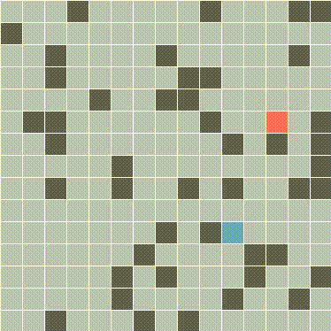

# Search Algorithm Visualization

This repository includes a visualization of different search algorithms. It consists of two main classes: the `Environment` class and the `Agent` class. The `Environment` class creates a setup with a target (red) and walls (black), and the agent's task is to interact with the environment to search for the target. Each agent has its own implemented search method. The `Environment` class is built using the pygame module.

The user can instantiate an environment instance by specifying the percentage of tiles that will be covered with walls. The user is also able to input the agent's starting position and the target position. After the agent completes searching, the agent outputs the searched path in blue if possible.

From the visualization, we see that depth-first search expands the most nodes, which demonstrates its inefficiency in such tasks. On the other hand, informed search algorithms such as greedy search and A* search with Manhattan heuristic performed the best on average.

## 1. Depth first search

  

    

  Depth-First Search Visualization

## 2. Breadth first search

  

    

  Breadth-First Search Visualization

## 3. Greedy search

  

    

  Greedy Search Visualization

## 4. A* search

  

    

  A* Search Visualization

