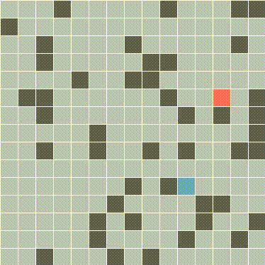

# Search Algorithm Visualization

This repository includes a visualization of different search algorithms. It consists of two main classes: the environment class and the agent class. The environment class creates a setup with a target (red) and walls (black), and the agent's task is to interact with the environment to search for the target. Each agent has its own implemented search method. The environment class is built using the pygame module.

## 1. Depth first search

  

